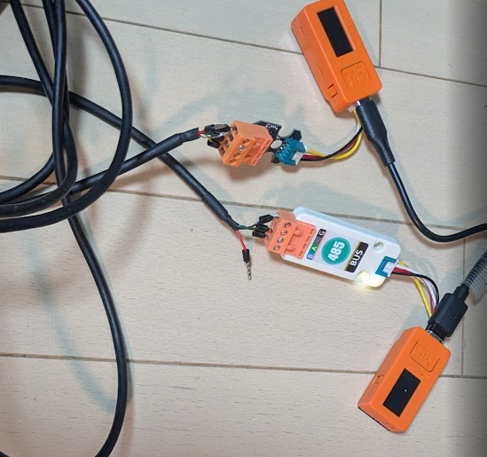

# RS-485 / UART 1Mbaud Communication Test Firmware



**ESP32 (M5StickC / AtomS3) での RS-485 / UART 1Mbaud 通信テスト結果**。
どの構成なら 1Mbaud で連続通信が安定するかを、フレーム CRC / FER / スループット実測で検証した FW 群。

> **注**: 本検証は **ESP32 からみた通信成否の実測** (送受信フレーム一致率) であり、オシロスコープで RS-485 A/B 線の波形を直接観測したものではない。「立上り時間」「スルーレート」等は IC データシートのカタログ値をもとにした推定・説明であり、物理測定したのは **FER (フレームエラー率)** のみ。

---

## 主要な結論: 1Mbaud 条件マトリクス

39 条件の実測 ([doc/202604092200_*](doc/202604092200_RS485-baudrate-eval-results.md)) を **1Mbaud に絞って** 4 つの代表パターンに整理:

| ラベル | IC | FW | ケーブル | 1Mbaud FER | rx 実効 (kbps) | 判定 |
|:---:|:---|:---|:---|:---:|:---:|:---:|
| **A** | Grove 直結 (IC なし) | Arduino HardwareSerial | ジャンパ 5cm | **95-96%** | ~60 | **✗** |
| **B** | Grove 直結 (IC なし) | **ESP-IDF UART API** | ジャンパ 5cm | **0%** | **~800** | **✓** |
| **C** | M5Stack RS485 Unit (SP485EE) × 2 | ESP-IDF UART API | RS-485 5m TPS | NG (magic_hits=0) | 60-80 (全化け) | **✗** |
| **D** | **Unit RS485-ISO (CA-IS3082W) (TX) → M5Stack RS485 Unit (SP485EE) (RX)** | **ESP-IDF UART API** | RS-485 5m TPS | **0%** | **~830 (101-109 KB/s)** | **✓ 完璧** |

### 読み方

- **A → B** (**FW だけ変えた効果**): Arduino `read()` 1 byte 律速を撤廃 → 取りこぼしゼロ
- **C → D** (**IC だけ変えた効果**): SP485EE のスルーレート制限を回避 (送信側を CA-IS3082W に変更) → 波形なまり解消
- **D が最終解**: **ESP-IDF UART API + CA-IS3082W 搭載 Unit RS485-ISO (送信側) = 1Mbaud 完璧動作** (実効 101-109 KB/s)

---

## ハードウェア構成

### 1Mbaud 動作実績の構成 (= 構成 D)

```
[M5StickC] ──Grove──> [Unit RS485-ISO]  ══ RS-485 5m TPS ══>  [M5Stack RS485 Unit] <──Grove── [M5StickC]
   TX側                  CA-IS3082W                                  SP485EE                       RX側
   (ESP-IDF API)         (絶縁型・スルーレート制限なし)               (受信側は SP485EE で OK)      (ESP-IDF API)
```

**送信側に CA-IS3082W (Unit RS485-ISO) を置くこと**が 1Mbaud 安定の要。受信側は SP485EE (M5Stack RS485 Unit) でも 1Mbaud / FER 0% 達成 (39 条件中 #32, #36, #39 等で実測済)。

> **注意 — 逆方向 (右→左) は同じ baud 不可**:
> 上の構成は **片方向 (TX=ISO485-ISO → RX=SP485EE) のみ 1Mbaud**。
> 逆向きに送ろうとすると **送信側が SP485EE になり、スルーレート制限のため 250kbaud が連続送信の実用上限** (500kbaud 連続で FER 95.6% 実測、構成 A 参照)。
> 双方向 1Mbaud にしたい場合は次節 (両端 Unit RS485-ISO) を参照。

### 必要なもの

| 役割 | パーツ | 搭載 IC | 備考 | リンク |
|------|-------|--------|------|-------|
| MCU × 2 | M5StickC または M5AtomS3 | ESP32 / ESP32-S3 | TX/RX 各 1 台 | [M5StickC](https://docs.m5stack.com/en/core/m5stickc) / [AtomS3](https://docs.m5stack.com/en/core/AtomS3) |
| **送信側 RS-485 変換** | **M5Stack Unit RS485-ISO** | **CA-IS3082W** (絶縁型、スルーレート制限なし) | **1Mbaud 対応に必須** | [M5Stack 公式](https://docs.m5stack.com/ja/unit/iso485) |
| 受信側 RS-485 変換 | M5Stack RS485 Unit | SP485EE | 受信側なら 1Mbaud OK | [Switch Science](https://www.switch-science.com/products/6554) |
| ケーブル | ツイストペアシールド 5m | - | GND 両端接続、シールド片端 | - |

### 双方向 1Mbaud にしたい場合

上の構成は **片方向 (TX→RX)** のみ 1Mbaud。**双方向で 1Mbaud** にする場合は **両端を Unit RS485-ISO** にする (SP485EE は送信側になると破綻するため):

```
[M5StickC] <──Grove──> [Unit RS485-ISO]  ══ RS-485 5m TPS ══>  [Unit RS485-ISO] <──Grove──> [M5StickC]
                          CA-IS3082W                                CA-IS3082W
```

### 配線のポイント ([詳細](doc/202604101200_RS485-multi-vendor-interop.md))

- **GND は両端接続** (片端のみだと 1Mbaud で 49% しか受信できない実測あり)
- **シールドは片端のみ接地** (両端だとグラウンドループ)
- **120Ω 終端抵抗** をバス両端に (反射低減)

---

## ビルド・アップロード

PlatformIO + Arduino framework v2 (`espressif32@6.9.0`)。lib 依存なし。

```bash
# 例: フル機能版 (rs485_trx 統合版、推奨)
cd rs485_trx
pio run -e m5stick-c -t upload --upload-port COMxx   # 1 台目
pio run -e m5stick-c -t upload --upload-port COMyy   # 2 台目
```

---

## シリアル操作 (115200 baud)

| cmd | 内容 |
|-----|------|
| `b<baud>` | baud 変更 (例: `b1000000`) |
| `s` | 統計表示 (ok/fail/FER/rx_bps) |
| `r` | 統計リセット |
| `?` | ステータス |

### `rs485_trx` 専用

| cmd | 内容 |
|-----|------|
| `m<0-3>` | モード (CONST / FRAME_SEQ / USB_THROUGH) |
| `d<0\|1\|2>` | 方向 (TX+RX / TX_ONLY / RX_ONLY) |
| `l<1-240>` | payload 長 (推奨 54/140/232) |
| `g<us>` | フレーム間隔 (bursty / throttled) |

---

## 測定手順

1. TX: `b1000000` → `l54` → `g0` (burst) または `g2000` (gap=2ms)
2. RX: `b1000000` → `r` でリセット
3. 10 秒待機
4. RX: `s` → `ok=xxxx fail=yyyy FER=zz%`

---

## 開発環境

| 項目 | バージョン / 内容 |
|------|----------------|
| ビルドシステム | [PlatformIO](https://platformio.org/) |
| フレームワーク | Arduino framework v2 (ESP-IDF 4.4 ベース) |
| Platform | `espressif32@6.9.0` |
| UART 実装 | **ESP-IDF `driver/uart.h` 直呼び出し** (4KB buffer + IRAM ISR) |

---

## フォルダ構成

| フォルダ | 用途 | フレーム |
|---------|------|---------|
| `rs485_tx/` | フル機能版 送信機 | 64B (SOF + seq + CRC16 + 54B payload) |
| `rs485_rx/` | フル機能版 受信機 | HUNT/LEN/BODY/CHECK 状態機械 |
| `uart_tx/` | 最小版 送信機 | 42B (seq + millis + 32B + CRC16) |
| `uart_rx/` | 最小版 受信機 | 1 byte シフト再同期 |
| **`rs485_trx/`** | **tx + rx 統合版** (現行推奨) | 方向制御 + payload 可変 |
| `doc/` | 測定結果レポート + 技術背景 | |

---

## 関連ドキュメント

| doc | 内容 |
|-----|------|
| [202604092200_RS485-baudrate-eval-results.md](doc/202604092200_RS485-baudrate-eval-results.md) | **メイン測定結果** (全 39 条件、4 構成 A-D の抜粋マトリクス含む) |
| [202604092000_RS485-IC-module-full-comparison.md](doc/202604092000_RS485-IC-module-full-comparison.md) | IC / モジュール全比較 (スルーレート制限の有無で切り分け) |
| [202604091500_RS485-DE-RE-auto-direction.md](doc/202604091500_RS485-DE-RE-auto-direction.md) | DE/RE 自動切替回路の解析 |
| [202604092230_RS485Unit-vs-ISO485Unit-comparison.md](doc/202604092230_RS485Unit-vs-ISO485Unit-comparison.md) | M5Stack RS485 Unit vs Unit RS485-ISO |
| [202604101200_RS485-multi-vendor-interop.md](doc/202604101200_RS485-multi-vendor-interop.md) | 配線・GND・シールド (1Mbaud 成功条件) |

---

## Appendix: 技術的背景 (読み飛ばし可)

### なぜ SP485EE は 1Mbaud で破綻するか

SP485EE は **スルーレート制限あり** な RS-485 IC。立上り/立下りを意図的に遅くして EMI を抑えた設計で、**500kbps 以下の低速用途向け**。

| 1 bit 時間 | SP485EE 立上り 20ns の占有率 |
|----------|-------------------------|
| 115,200 baud: 8.7μs | 0.23% (問題なし) |
| 500 k baud: 2μs | 1% (まだ OK) |
| **1 M baud: 1μs** | **2% + 前後テール** → **ケーブル容量が加わると頂点到達前に次ビット** (ISI) |

一方 **CA-IS3082W はスルーレート制限なし** (定格 20Mbps)、立上り <5ns → 1Mbaud でも波形が追従する。

### DE/RE 自動切替回路との関係

本プロジェクトで使う M5Stack Unit 2 種は **いずれも基板上で DE/RE 自動切替**を持つが、**主因はスルーレートであり DE/RE は副次的**。
- 連続送信時に DE/RE 検出回路の放電時定数で誤切替 → `gap=2ms` で回復する (これが DE/RE 問題である証拠)
- CA-IS3082W モジュール (Unit RS485-ISO) は BSS138 MOSFET 設計で改善、かつスルーレート制限なしなので両者解決

詳細: [doc/202604091500_RS485-DE-RE-auto-direction.md](doc/202604091500_RS485-DE-RE-auto-direction.md)

### Arduino HardwareSerial vs ESP-IDF UART API

| 通信パターン | Arduino `HardwareSerial` | ESP-IDF `driver/uart.h` |
|------------|------------------------|------------------------|
| 連続ストリーム (ブリッジ透過等、duty ~100%) | **NG** (byte 律速、256B buffer overflow) | **OK** (4KB buf + IRAM ISR) |
| Request-Response (サーボ READ 等、duty ~5%) | **OK** (十分な gap あり) | **OK** |

本プロジェクトの測定は主に連続ストリーム系、SCS サーボ等の間欠通信では Arduino でも十分。

---

## License

[MIT License](LICENSE)

## Related

- [SO101_ESPNOW_control](https://github.com/uecken/SO101_ESPNOW_control) — 本検証結果を応用した SO-101 テレオペ
